This a 77 year-old patient who was on blood thinners and had to have #6, and #8 removed as they were both unrestorable. We also had to remove the #7 implant as it had a significant amount of bone loss (more than 4.5mm of bone loss on coronal portion and super thin bone on buccal). Implant had to be removed to properly graft the site.

We used our [Waterlase iplus](https://www.biolase.com/products/dental-lasers-all-tissue/waterlase-iplus/) to trough around the implant and used 1.0cc of [<u>mineralized cortical cancellous bone</u>](https://www.ddsgadget.com/biologics/bone-grafting/allografts/mineralized-cortical-cancellous-bone-0418.html) mixed with iPRF and A-PRF (sticky bone). PRF was created using the [<u>Horizontal PRF Centrifuge</u>](https://www.ddsgadget.com/horizon-6-flex-premium-horizontal-centrifuge-prf.html).

We covered the graft with A-PRF membranes, followed by [<u>non-resorbable PTFE membrane</u>](https://www.ddsgadget.com/biologics/membranes/non-resorbable-membranes.html) (primary closure was going to be difficult in this case). We also did PET (Partial extraction therapy or Socket Shield at site #6, but was not able to do so at Site #8 due to the amount of bone loss on the buccal). We covered the PTFE membrane with another layer of A-PRF. Our plan is to place an implant at site #6 and one at site #8 and do a 3 unit bridge as a final restoration.

Play the video below to watch the case. Additional slides are below.

<iframe allowfullscreen="" frameborder="0" height="315" src="https://www.youtube.com/embed/MV9N2NvUUUA?rel=0" width="560"></iframe>

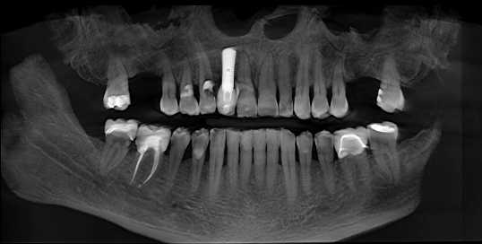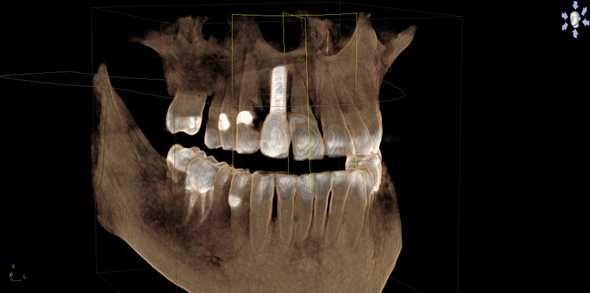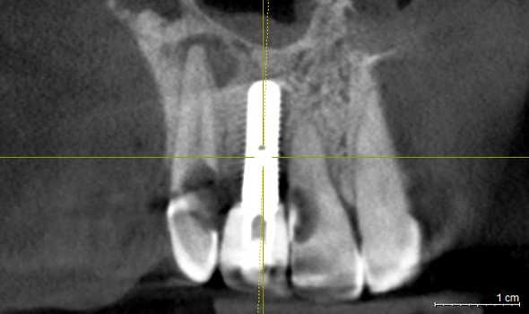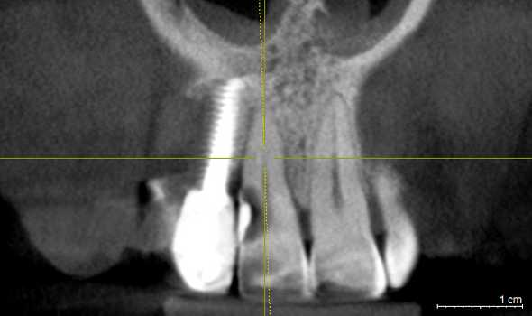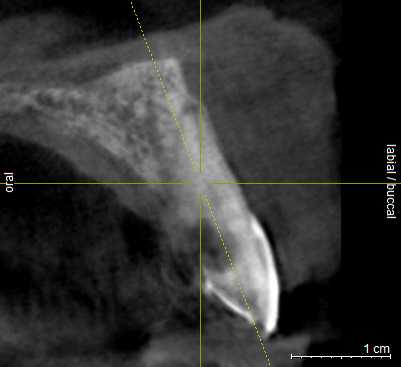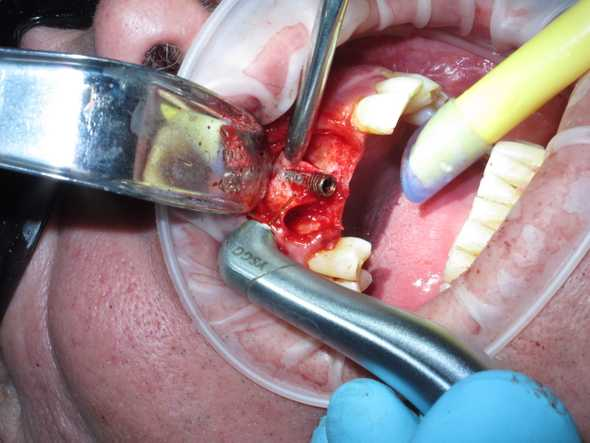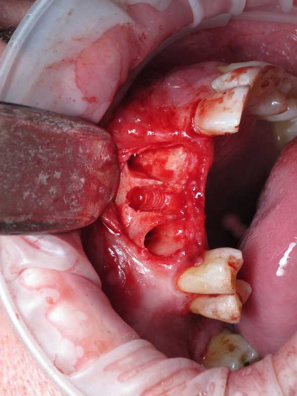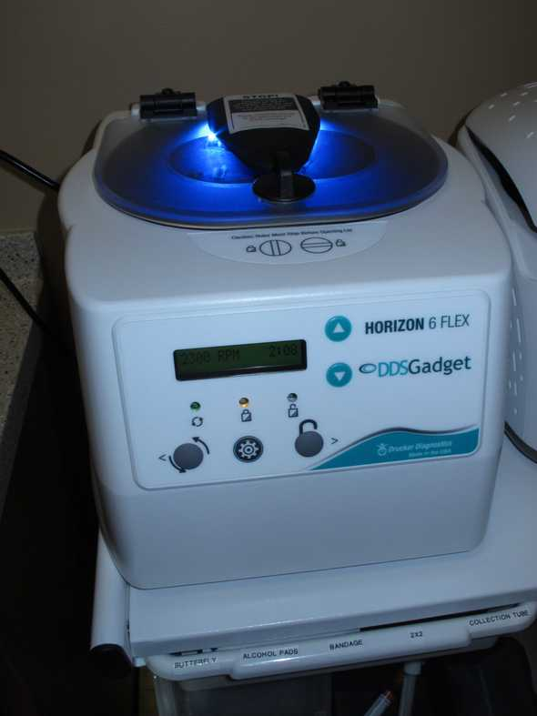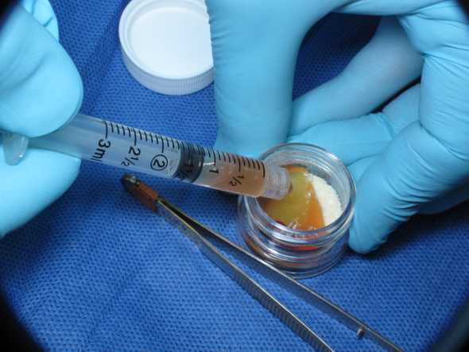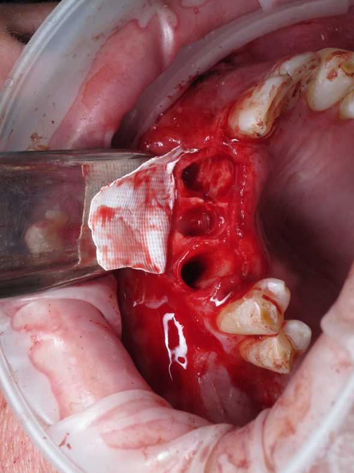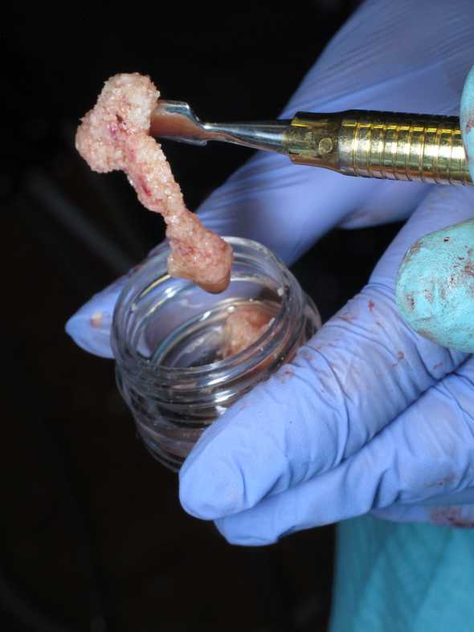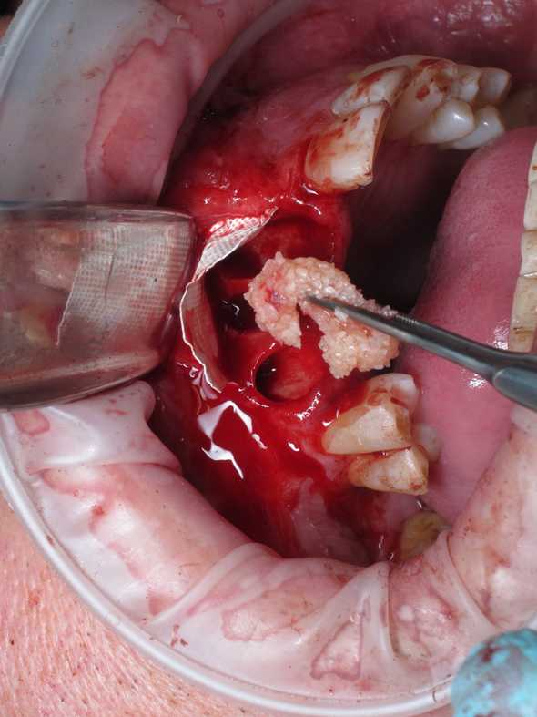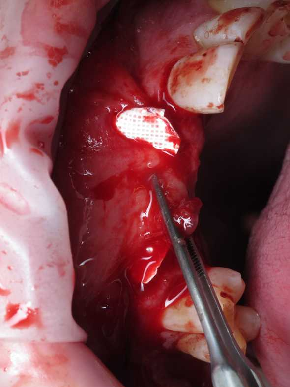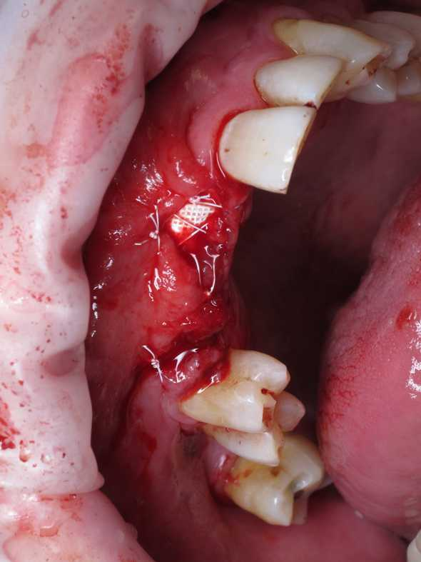
