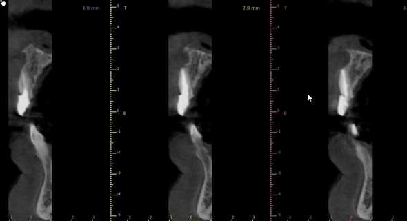
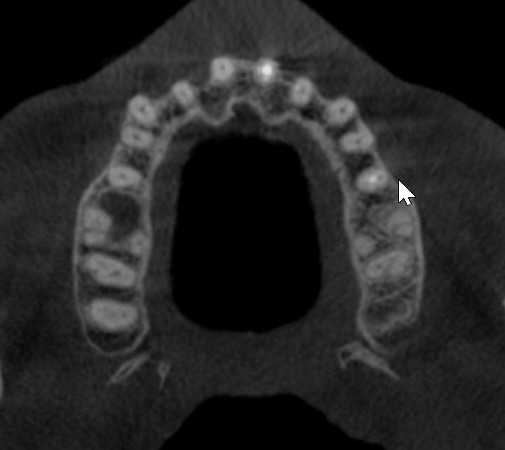

I have a 45-year old male patient, non-smoker, with clear medical history. He has a non-restorable 21 (or #9). The patient has deep bite and is basically Class II Div II occlusion.  
3D image indicates limited labial plate over 21 tooth. I just wonder if I want to extract this tooth and restore the space,what will be the best option:

1)Extract, graft the extraction socket (socket preservation) and delayed implant placement with delayed loading

or

2)Extract, expand the ridge, immediate implant placement (obviously it will be off angle and I will have restorative challenge) with or without labial bone augmentation with or without membrane, delayed loading 6 months later.

I am really looking forward to see your expert opinions on this case.

