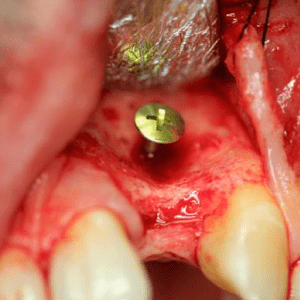

I travel to different offices doing implants and wisdom teeth. It’s common to review a CBCT of an implant candidate and find adequate height , but inadequate width. (I see some 3.5mm implants used for molars and I don’t feel comfortable with that). There are a lot of techniques to graft for width. I’ve found that the Tent Grafting technique is fast, easy, and predictable. I use the KLS Martin kit. I think the pictures and x-rays say it all.  
(*ON Note: See also [Tenting Screw Kit](https://www.ddsgadget.com/tenting-screw-kit.html)*)

